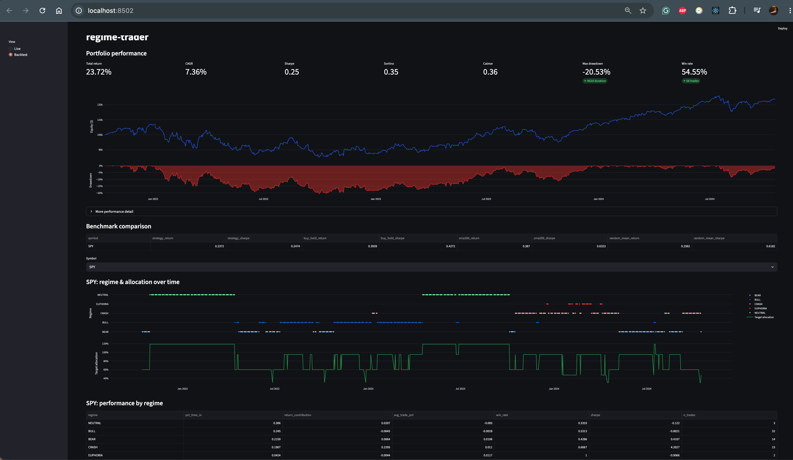

# regime-trader



A systematic trading bot that classifies market **volatility regimes** with a
Gaussian Hidden Markov Model and drives portfolio allocation off that
classification. It does not predict price direction. It is long-only, built
on Alpaca (paper trading by default), and was built in nine phases, each
reviewed and tested before the next began.

> **Status:** All 9 phases complete. 169 automated tests passing, 1
> intentionally skipped (requires a real Alpaca paper account — see
> [Paper-trading verification](#paper-trading-verification)).

<!-- ---

## Disclaimer
- Nothing here is investment advice, and no profit is guaranteed or implied.
- Trading involves real financial risk, including the risk of total loss.
- Every strategy, parameter, and assumption in this repository must be
  independently validated and extensively tested by you before you consider
  risking real capital.
- **Paper trade for at least a month** before even thinking about live
  trading — see the checklist below.
- The authors/contributors accept no liability for losses incurred by using
  this code.

--- -->

## Philosophy: risk management > signal generation

The single most important design decision in this codebase is the order of
priority between its layers. A lot of trading-bot projects pour all their
effort into the signal — the HMM, the strategy rules — and treat risk
management as an afterthought bolted on at the end. This project inverts
that:

1. **The HMM can be wrong.** It's a statistical model fit on a few hundred
   data points; regimes it hasn't seen before, structural breaks, and
   outright bugs are all real possibilities.
2. **The risk manager assumes it is wrong**, and is built to contain the
   damage regardless. `core/risk_manager.py`'s circuit breakers fire off
   *actual portfolio drawdown*, not off what the HMM thinks the regime is.
   A stress test (`backtest/stress_test.py`) deliberately shuffles regime
   labels into nonsense and checks that pure position-sizing bounds alone
   still contain the damage, with no help from the (by-definition-wrong)
   signal.
3. **The risk manager has the last word.** Every signal that reaches a
   broker call has passed through `RiskManager.validate_signal()`, which can
   shrink it, force its leverage down, or refuse it outright — and nothing
   downstream is allowed to override that decision.

If you remember one thing about how to extend this codebase safely, make it
this: a better strategy that bypasses risk management is a worse system,
not a better one.

---

## Architecture

```
┌──────────┐   ┌───────────────┐   ┌─────────────┐   ┌───────────┐   ┌──────────────┐   ┌──────────────┐   ┌────────┐
│  Market  │──▶│   Features    │──▶│  HMM regime │──▶│ Vol rank  │──▶│  Allocation  │──▶│     Risk     │──▶│ Broker │
│  data    │   │ (standardized │   │  classifier │   │ (strategy │   │   (Signal:   │   │  (validate,  │   │ (Alpaca│
│ (OHLCV)  │   │  z-scores)    │   │  (filtered, │   │  tier per │   │  size, stop, │   │  shrink, or  │   │ orders,│
│          │   │               │   │  causal)    │   │  regime)  │   │  leverage)   │   │  reject)     │   │ fills) │
└──────────┘   └───────────────┘   └─────────────┘   └───────────┘   └──────────────┘   └──────────────┘   └────────┘
 data/           data/               core/              core/           core/              core/              broker/
 market_data.py  feature_            hmm_engine.py       regime_         regime_            risk_              alpaca_
                 engineering.py                          strategies.py   strategies.py      manager.py         client.py
                                                          (Orchestrator)  (Signal)                              order_
                                                                                                                 executor.py
```

Everything above is wired together and run continuously by
**`core/trading_bot.py`** (`TradingBot`), with **`main.py`** as the CLI
entry point, and observed through **`monitoring/`** (structured logs, an
alert manager, and a live terminal dashboard).

### Module map

| Path | What it does | Phase |
|---|---|---|
| `config/settings.yaml` | Every tunable parameter, grouped by subsystem | 1 |
| `data/feature_engineering.py` | Pure functions: OHLCV → 14 standardized volatility/trend/momentum features | 2 |
| `core/hmm_engine.py` | `HMMRegimeEngine` — BIC model selection, **hand-written forward-algorithm filtering** (never Viterbi `predict()` — see [FAQ](#why-forward-algorithm-not-viterbi)), stability/flicker tracking | 2 |
| `core/regime_strategies.py` | `StrategyOrchestrator` + 3 volatility-tier strategies (`LowVolBull`, `MidVolCautious`, `HighVolDefensive`) producing a `Signal` | 3 |
| `backtest/backtester.py` | Walk-forward (train 252 / test 126 / step 126 bars) allocation backtester, no look-ahead | 4 |
| `backtest/performance.py` | Sharpe/Sortino/Calmar, drawdown, per-regime and per-confidence breakdowns, 3 benchmarks | 4 |
| `backtest/stress_test.py` | Crash injection, gap injection, regime-label-shuffle Monte Carlo tests | 4 |
| `core/risk_manager.py` | `RiskManager` + `CircuitBreaker` — absolute veto power, independent of the HMM | 5 |
| `broker/alpaca_client.py` | Retry-hardened Alpaca SDK wrapper; live-trading requires typed confirmation | 6 |
| `broker/order_executor.py` | Limit-then-market entries, bracket orders, stop-tightening-only | 6 |
| `broker/position_tracker.py` | Tracked positions with regime/P&L context; broker reconciliation | 6 |
| `data/market_data.py` | Historical bars, latest quote/snapshot, live WebSocket subscriptions | 6 |
| `core/trading_bot.py` | `TradingBot` — startup, the per-bar decision pipeline, retraining, state snapshots, shutdown | 7 |
| `monitoring/logger.py` | Structured JSON logs, 4 rotating files | 8 |
| `monitoring/dashboard.py` | Live terminal dashboard (rich) | 8 |
| `monitoring/alerts.py` | Rate-limited alerts: console/log/email/webhook | 8 |
| `main.py` | CLI: `backtest`, `run` (live/paper, `--dry-run`, `--train-only`, `--dashboard`, `--live-dashboard`, `--web-dashboard`) | 4, 7 |
| `dashboard_app.py` | Streamlit web UI: live bot state + a backtest-results explorer | 8 |
| `demo.py` | Standalone script demonstrating Phases 1-3 on real data (no broker needed) | 1-3 |

---

## Quick start

1. **Clone and install:**
   ```bash
   cd regime-trader
   pip install -r requirements.txt
   ```
2. **Set up credentials** — all of them live in `.env`, nowhere else:
   ```bash
   cp .env.example .env
   ```
   Then open `.env` and REPLACE the placeholder values with your free
   paper-trading keys from [alpaca.markets](https://alpaca.markets):
   ```
   ALPACA_API_KEY=your_key_here      ->  ALPACA_API_KEY=PK...
   ALPACA_SECRET_KEY=your_secret_here -> ALPACA_SECRET_KEY=...
   ```
   Steps 1-4 below work without real keys. Steps 5-7 need real (free)
   paper keys in `.env` — if you see "Could not connect to Alpaca", `.env`
   still has the `your_key_here` / `your_secret_here` placeholders in it.
3. **Run the test suite** — confirms your environment is sound before you
   touch real (even paper) money:
   ```bash
   pytest tests/
   ```
4. **Backtest first.** Never skip this step:
   ```bash
   python main.py backtest --symbols SPY --start 2019-01-01 --end 2024-12-31 --compare
   ```
5. **Train the HMM and inspect it** before letting it trade anything:
   ```bash
   python main.py run --train-only
   ```
6. **Dry-run the live loop** (full pipeline, zero orders submitted) before
   ever letting it touch your paper account:
   ```bash
   python main.py run --dry-run
   ```
   Only once you've watched a dry run behave sensibly for a while should you
   drop `--dry-run` and let it trade your **paper** account. See the
   [checklist](#final-validation--paper-trading-checklist) below before you
   do that.
7. **Open the dashboard** to actually watch step 6 run, instead of reading
   log lines. Two options, your choice — run one in a second terminal
   while step 6 is still running:
   ```bash
   python main.py run --dry-run --live-dashboard 
   ```
   or, for a browser UI, re-run step 6 with `--web-dashboard` added, then
   in a second terminal:
   ```bash
   streamlit run dashboard_app.py
   ```
   This opens `http://localhost:8501` in your browser automatically, with
   a "Live" view showing regime/portfolio/positions/risk, and a "Backtest"
   view over the results from step 4. See
   [Web dashboard](#web-dashboard-streamlit) below for details.

---

## CLI reference

```
python main.py backtest --symbols SPY --start 2019-01-01 --end 2024-12-31
python main.py backtest --symbols SPY --start 2019-01-01 --end 2024-12-31 --compare
python main.py backtest --symbols SPY QQQ --stress-test [--n-simulations 100]

python main.py run                    # live/paper trading loop (needs real Alpaca keys in .env)
python main.py run --dry-run          # full pipeline, no orders submitted
python main.py run --train-only       # train the HMM and exit
python main.py run --dashboard        # show the last saved state snapshot and exit
python main.py run --live-dashboard   # run with the live auto-refreshing dashboard UI in this terminal
python main.py run --web-dashboard    # feed dashboard_state.json for `streamlit run dashboard_app.py`
```

| Flag | Effect |
|---|---|
| `--symbols` | One or more tickers (backtest only; `run` always trades `config/settings.yaml`'s `broker.symbols`) |
| `--start` / `--end` | Backtest date range |
| `--compare` | Also run buy-and-hold / 200-SMA-trend / randomized-allocation benchmarks |
| `--stress-test` | Run crash/gap/regime-shuffle Monte Carlo tests instead of a normal backtest |
| `--n-simulations` | Monte Carlo count for `--stress-test` (default 100 — slow, retrains the HMM every simulation) |
| `--dry-run` | Runs the full live pipeline (HMM → strategy → risk) but submits no orders |
| `--train-only` | Trains/retrains the HMM, saves `hmm_model.pkl`, exits |
| `--dashboard` | Prints the last saved `state_snapshot.json` and exits — a one-time snapshot, not a live view (combine with a separately-running `run` instance to inspect its last save) |
| `--live-dashboard` | Runs the bot with the REGIME/PORTFOLIO/POSITIONS/... dashboard panel live in this terminal, auto-refreshing every `monitoring.dashboard_refresh_seconds`. Console log lines are suppressed while it's active (they'd fight the dashboard for the same terminal region) — tail `logs/main.log` in another terminal for text logs meanwhile. |
| `--web-dashboard` | Continuously writes `dashboard_state.json` to disk so a separately-running `streamlit run dashboard_app.py` can poll it — see [Web dashboard](#web-dashboard-streamlit) below. Combine freely with `--live-dashboard` and/or `--dry-run`. |

Combine `--dry-run` with `--live-dashboard` to watch the full decision
pipeline live without placing real orders — the best way to get a feel for
the system before your first real paper-trading session.

---

## Web dashboard (Streamlit)

`dashboard_app.py` is a browser-based alternative to the terminal
dashboard, with two views:

- **Live** — polls `dashboard_state.json`, which `python main.py run
  --web-dashboard` writes every `monitoring.dashboard_refresh_seconds`.
  Same regime/portfolio/positions/risk/system panel as the terminal
  dashboard, laid out for a browser instead.
- **Backtest** — reads `backtest_results/*.csv` (produced by `python
  main.py backtest ...`) and renders the equity curve + drawdown, trade
  log, and per-regime/per-confidence breakdowns interactively, computed
  with the exact same `backtest/performance.py` functions the CLI report
  uses.

```bash
pip install -r requirements.txt   # adds streamlit + plotly
python main.py run --dry-run --web-dashboard   # in one terminal
streamlit run dashboard_app.py                 # in another, from regime-trader/
```

The Live view has the same IPC limitation as `--live-dashboard` (see the
FAQ below): it only shows a bot that's actually writing
`dashboard_state.json` right now, not an arbitrary already-running
instance you didn't start with `--web-dashboard`.

---

## Configuration guide

Every tunable parameter lives in `config/settings.yaml`, grouped by
subsystem, each with an inline comment. A few worth understanding before you
touch them:

- **`hmm.n_candidates` / `hmm.n_init`**: how many regime-count candidates to
  try and how many random EM restarts each gets. More = slower training,
  marginally more robust model selection. `hmm.covariance_type: "full"` is
  the production default; it's data-hungry (see
  [FAQ](#why-did-training-crash-with-a-covariance-error)) — tests use
  `"diag"` for speed.
- **`strategy.*_allocation` / `*_leverage`**: the three volatility-tier
  strategies' target allocations and leverage. `low_vol_leverage: 1.25` is
  the *only* place leverage > 1.0 is ever requested, and even that gets
  vetoed by `risk.max_leverage` and the uncertainty/flicker rules in
  `core/risk_manager.py`.
- **`risk.*`**: the actual safety rails — read `core/risk_manager.py`'s
  module docstring before changing these. In particular,
  `risk.max_single_position` (15%) is deliberately far below any one
  strategy's own allocation request (60-95%), because the system is
  designed to run one regime signal across the whole `broker.symbols`
  basket, not concentrate in a single name.
- **`backtest.train_window` / `test_window` / `step_size`**: the
  walk-forward schedule (default: retrain every 126 bars on a trailing
  252-bar window). Shrinking these speeds up backtests but gives the HMM
  less data per retrain.

To experiment safely: change one parameter, re-run
`python main.py backtest --compare`, and compare the resulting Sharpe/max
drawdown/benchmark numbers before changing anything else. See
[Iterating on parameters](#final-validation--paper-trading-checklist).

---

## FAQ

### Why forward algorithm, not Viterbi (`predict()`)?

`hmmlearn`'s `model.predict()` runs the Viterbi algorithm, which finds the
single most likely STATE SEQUENCE for the *entire* data you give it — which
means it can revise its opinion about what regime you were in yesterday
based on data from tomorrow. That's look-ahead bias, and in a backtest it
makes a strategy look much better than it would have performed live.
`core/hmm_engine.py`'s `predict_regime_filtered()` instead hand-implements
the forward algorithm in log-space: the regime at bar *t* is computed using
only observations from bar 1 through *t*. `tests/test_look_ahead.py` and
`tests/test_integration.py::test_backtest_identical_with_different_end_dates`
both exist specifically to catch a regression here — if someone
accidentally swaps in `.predict()`, these tests fail.

### How does BIC model selection work, and why not just pick a fixed number of regimes?

Markets don't owe you a fixed number of volatility regimes. The guide calls
for testing candidate regime counts (3 through 7 by default) and picking
the one with the lowest Bayesian Information Criterion —
`BIC = -2·log_likelihood + n_params·log(n_samples)` — which penalizes extra
regimes unless they earn their keep in likelihood. This also means the
*same* regime label (e.g. "BULL") can mean a different volatility level
across different retrains; the strategy layer accounts for this by ranking
regimes by their own volatility each time, never by their label (see
`core/regime_strategies.py`'s module docstring).

### Why did my trade get rejected / resized? How do I find out?

Every call to `RiskManager.validate_signal()` returns a `RiskDecision` with
`approved`, `modified_signal`, `rejection_reason`, and a `modifications`
list of human-readable strings (e.g. `"size capped from 118.8% to 15.0%
(1%-risk/gap/regime/position caps)"`). `core/trading_bot.py` logs all of
these and records them in `recent_signals` (visible on the dashboard). Read
`core/risk_manager.py`'s `validate_signal()` top to bottom — it's a linear
pipeline of checks, each one documented at the point it can reject or
shrink a trade.

### Why did training crash with a covariance error?

With `covariance_type: "full"` and 14 correlated features, a regime that EM
assigns very few or very tightly-clustered samples to can end up with a
numerically near-singular covariance matrix. `core/hmm_engine.py`'s
`_log_emission()` adds a small ridge (`_COV_JITTER`) and passes
`allow_singular=True` to guard against this — if you still hit this, it
usually means a regime count/data combination is badly overfit; try fewer
candidates or more training data.

### How do I switch from paper to live trading?

Set `broker.paper_trading: false` in `config/settings.yaml` (or
`ALPACA_PAPER=false` in `.env`). The next `AlpacaClient` construction will
block and require you to type `YES I UNDERSTAND THE RISKS` exactly — see
`broker/alpaca_client.py`'s `confirm_live_trading()`. **Do not do this**
until you've completed the [paper-trading checklist](#final-validation--paper-trading-checklist)
below.

### How do I open the dashboard UI?

Run the bot with `python main.py run --live-dashboard` (add `--dry-run` too
if you just want to watch it without placing orders). That shows the live,
auto-refreshing REGIME/PORTFOLIO/POSITIONS/RISK STATUS/SYSTEM panel from
the Phase 8 spec, right in that terminal. Prefer a browser? Add
`--web-dashboard` instead (or alongside it) and run `streamlit run
dashboard_app.py` separately — see [Web dashboard](#web-dashboard-streamlit).

Both only work attached to a process you're starting — there's no IPC
channel between an *already-running* bot and a second CLI invocation (that
would need a local socket server or shared-memory region, which was out of
scope). `--web-dashboard` works around this with a file instead of a
socket: the bot overwrites `dashboard_state.json` on every refresh, and
`dashboard_app.py` just polls that file from a separate process — close
enough to live for a dashboard, with none of that complexity. Plain
`--dashboard` (no `--live-`/`--web-`) is the simplest fallback: it prints
the last `state_snapshot.json` a running instance saved (at shutdown, or
after an unhandled error) — a point-in-time snapshot from another
terminal, not a live view.

---

## Testing

```bash
pytest tests/                              # full suite (~2 min; a few tests retrain small HMMs)
pytest tests/ --ignore=tests/test_stress_test.py  # skip the slow Monte Carlo stress tests
pytest tests/test_look_ahead.py -v          # the single most important test in this repo
```

The suite is organized to mirror the phases above (`test_hmm.py`,
`test_strategies.py`, `test_risk.py`, `test_orders.py`, `test_trading_bot.py`,
`test_alerts.py`, ...), plus `tests/test_integration.py` for the
cross-phase scenarios in [Final validation](#final-validation--paper-trading-checklist)
below. Nearly everything is tested against mocked broker/data clients —
`tests/test_integration.py::test_alpaca_paper_trading_requires_real_credentials`
is the one deliberate exception, skipped because it needs a real account.

---

## Final validation / paper-trading checklist

Before paper trading:
- [ ] Run the complete test suite and confirm everything passes
      (`pytest tests/`).
- [ ] Run `python main.py backtest --symbols <your symbols> --compare` across
      more than one historical period, and read the per-regime and
      per-confidence breakdown tables, not just the headline Sharpe.
- [ ] Run `python main.py backtest --stress-test` and read the regime-shuffle
      result honestly — if `contained` is `False`, risk management isn't
      independent enough yet, full stop.
- [ ] Run `python main.py run --dry-run` for a while and read the logs:
      does every rejection/modification make sense to you?

During paper trading (**at least one month**, per the guide):
- [ ] Watch the dashboard. For every rebalance: do you understand *why*
      (regime change? drift past `strategy.rebalance_threshold`?). For every
      bar it stayed put: is that because it's genuinely at target, or
      because something's silently broken?
- [ ] Watch for every risk-manager override in the logs and ask whether it
      was the right call.
- [ ] Monitor circuit-breaker events specifically — did the HMM's regime
      call line up with what actually happened, or was it wrong and the
      breaker caught it anyway (that's the system working as designed)?
- [ ] Re-run the test suite and a fresh backtest after *any* configuration
      or code change, however small.

Only after all of the above should live trading even be a conversation —
and even then, start at a notional size you could lose without it mattering.

---

## Paper-trading verification

One thing the automated test suite cannot cover: placing a real order
against a real (paper) Alpaca account. `tests/test_integration.py` documents
this gap with a skipped test; to actually verify it yourself once you have
Alpaca paper keys in `.env`:

1. `python main.py run --train-only` to get a model, then start
   `python main.py run` (not `--dry-run`) against your paper account.
2. Confirm a bracket order appears in your Alpaca dashboard: entry + stop +
   take-profit legs.
3. Let `core/trading_bot.py`'s trailing-stop logic tighten the stop over a
   few bars; confirm in Alpaca that the stop price only ever moves up, never
   down.
4. Manually trigger a close (`OrderExecutor.close_position()` via a Python
   shell, or just let a signal naturally exit) and confirm the account
   returns to a clean, fully-closed state with no orphaned child orders.
